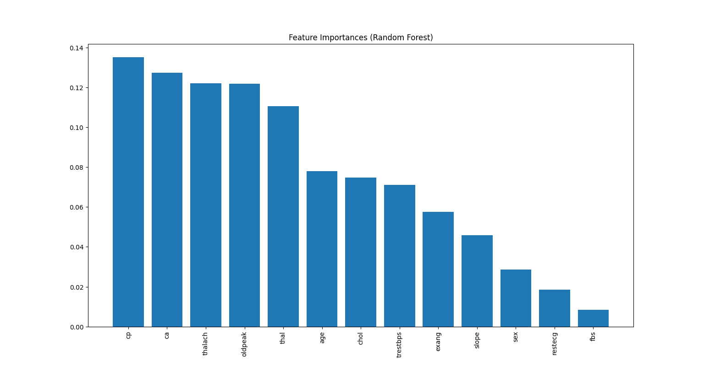

# Decision-Trees# Decision Trees & Random Forests - Heart Disease Classification

## 📌 Task Overview

The objective is to **explore tree-based models** for classification, control overfitting, interpret feature importances, and evaluate performance using cross-validation.  
The implementation is done as an **interactive Streamlit dashboard** for better visualization and experimentation.

---

## 📂 Dataset
I used the **Heart Disease Dataset** from Kaggle.  

- **Target variable:** `target` (0 = No Disease, 1 = Disease)  
- **Features:** 13 numerical & categorical health-related measurements  
- **Shape:** 303 rows × 14 columns  

**Dataset Link:**  
[Heart Disease Dataset - Kaggle](https://www.kaggle.com/datasets/johnsmith88/heart-disease-dataset)  

---

## ⚙️ Steps Performed
1. **Data Loading**
   - Load from uploaded CSV or use default `heart.csv`

2. **Train/Test Split**
   - User-controlled split via slider (default 80% training, 20% testing)

3. **Model Building**
   - **Decision Tree Classifier**
     - Adjustable `max_depth` (via sidebar slider)
   - **Random Forest Classifier**
     - Adjustable `max_depth` & `n_estimators` (via sidebar sliders)

4. **Model Evaluation**
   - Accuracy score
   - Confusion matrices (heatmap)
   - Classification reports
   - Cross-validation accuracy (5-fold)

5. **Interpretability**
   - Feature importance plot (Random Forest)
   - Matplotlib decision tree plot with user-defined depth

---

## 📊 Example Output

**=== Model Accuracy ===**  
Decision Tree Accuracy: 85.24%  
Random Forest Accuracy: 88.52%  

**=== Cross-Validation ===**  
Decision Tree CV Accuracy: 83.91%  
Random Forest CV Accuracy: 87.45%  

**Confusion Matrix (Decision Tree)**  
```
[[41  9]
 [ 6 43]]
```

**Feature Importances (Random Forest)**  


---

## 📈 Visualizations
- Confusion matrices (heatmaps)  
- Feature importance bar chart  
- Decision tree diagram (zoomable by controlling depth)  

---

## 📦 Requirements
```bash
pip install streamlit pandas scikit-learn seaborn matplotlib
```

---

## ▶ How to Run
```bash
python -m streamlit run Decision_tree.py
```
Then open the local URL provided in the terminal.
